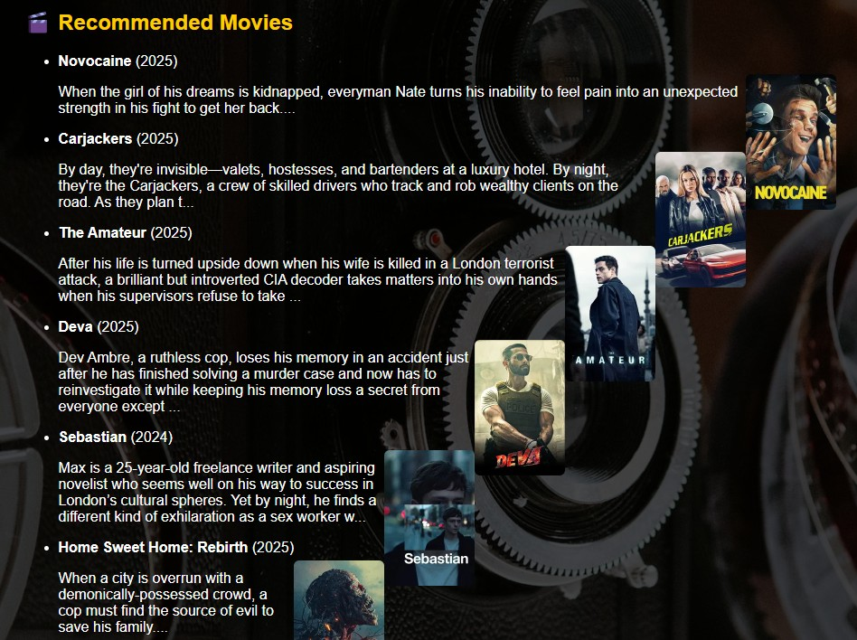
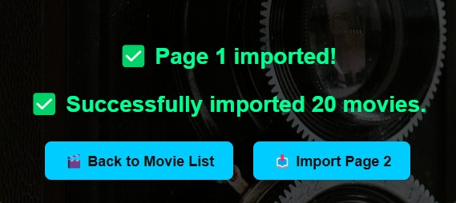

# 🎬 Moving Recommendation System
  A full-stack Flask web application for browsing, reviewing, rating and exporting movie data. Integrated with The Movie Database (TMDb) API and MongoDB, this app provides real-time popular movies, user authentication, admin features, comment management, and data export tools.
  
You can check out the live site here 👉 [movie-recommendation-system-s.onrender.com](https://movie-recommendation-system-s.onrender.com)

  <a href="https://movie-recommendation-system-s.onrender.com" target="_blank" style="text-decoration:none;">
    <strong style="background-color:#28a745;color:white;padding:10px 16px;border-radius:6px;">Click here to visit the website</strong>
  </a>

## 🏠 Feature
- 🎥 View popular movies (fetched from TMDb)

- 🔤 Movie detail pages with plot, cast, director, and reviews

- ✍️ Add personal reviews and ratings (authenticated users only)

- 🔍 Search movies by title, genre, year, or TMDb ID

- 📥 Export data as CSV or JSON:

  - Movie list

  - Movie detail (with local & TMDb reviews)

  - User comments

  - Registered users (JSON only)

- 📈 Admin dashboard with login logs and comment activity

The admin panel provides an overview of login history, active users, recent comments, and login logs — all with pagination support

- 🎓 User login, registration, password reset

- 📊 Comment search and in-place management

- 📚 Caching for TMDb data with scheduled re-import

## 📚 Tech Stack
- Backend: Python, Flask

- Frontend: Jinja2 Templates, HTML/CSS, JavaScript

- Database: MongoDB

- External API: TMDb API

- Security: Flask-Bcrypt, hashed passwords, session control
## 🔧 Setup Instructions
1. Clone the repo
<pre>
  git clone https://github.com/your-username/movie-rating-app.git
  cd movie-rating-app 
</pre>
2. Install dependencies
<pre>
  pip install -r requirements.txt
</pre>
3. Set environment variables
<pre>
  export MONGO_URI='your_mongodb_connection_string'
  export FLASK_APP=app.py
  export FLASK_ENV=development
</pre>
4. Run the app
<pre>
  python app.py
</pre>
Visit http://127.0.0.1:5000 in your browser.
## 📦 File Structure Overview
<pre>
├── app.py                 # Main Flask application
├── templates/             # HTML templates (Jinja2)
├── static/                # CSS, JS, images
├── requirements.txt       # Python dependencies
├── README.md              # Project documentation
</pre>
## 🚀 TMDb API Key
This app uses the TMDb API. Make sure you set your own API key in the code:
<pre>api_key = "your_api_key_here"</pre>
Apply for a free key at https://www.themoviedb.org/settings/api.
## 🧱 Admin Access
To enable admin dashboard access, manually set a user as admin in MongoDB:
<pre>
  {
  "username": "your_username",
  "is_admin": true
}
</pre>
## ✨ Acknowledgements
- TMDb for movie data

- Flask, PyMongo, ReportLab for PDF/CSV export
